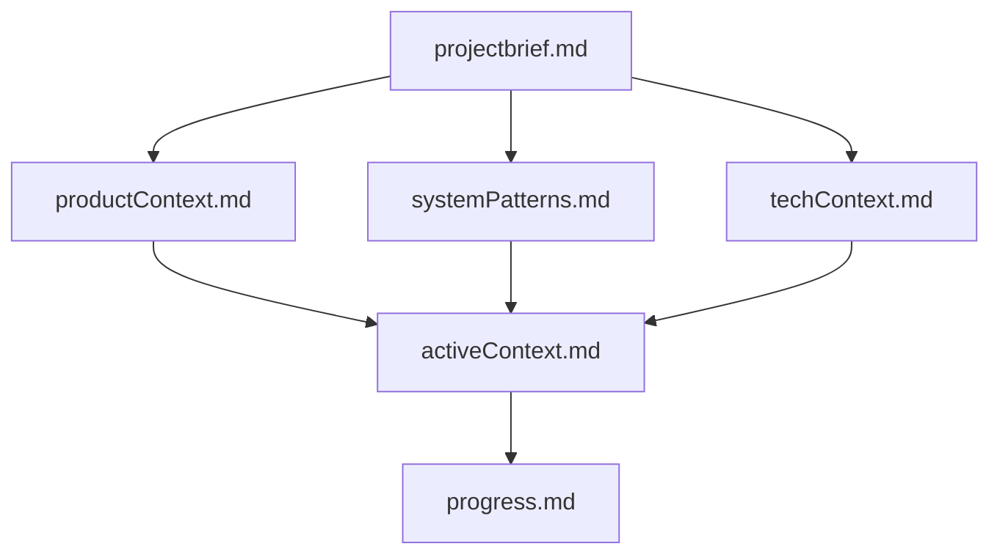

# Memory Bank: Collab Canvas v3

## Overview
This Memory Bank serves as the complete knowledge base for the Collab Canvas v3 project. Since my memory resets between sessions, these files are critical for maintaining context and continuity.

## File Structure
```
memory-bank/
├── README.md              # This file - navigation guide
├── projectbrief.md        # Foundation: core requirements and goals
├── productContext.md      # Why: problems solved and user experience
├── activeContext.md       # Now: current work and immediate focus
├── systemPatterns.md      # How: architecture and design patterns
├── techContext.md         # With: technologies and setup
└── progress.md            # Status: what works and what's next
```

## File Hierarchy


## Quick Start
**Starting a new session?** Read in this order:
1. `projectbrief.md` - Understand the project
2. `activeContext.md` - Know what's happening now
3. `progress.md` - See current status
4. Other files as needed for specific tasks

## File Purposes

### projectbrief.md (Foundation)
- Core requirements and goals
- Project scope and constraints
- Success criteria
- Source of truth for project direction

### productContext.md (Why)
- Problems being solved
- User experience goals
- Feature descriptions
- Value proposition

### activeContext.md (Now)
- Current focus and tasks
- Recent changes
- Open questions and decisions
- Immediate next steps

### systemPatterns.md (How)
- System architecture
- Design patterns
- Component relationships
- Technical decisions

### techContext.md (With)
- Technology stack
- Development setup
- Dependencies
- Technical constraints

### progress.md (Status)
- What's complete
- What's in progress
- What's left to build
- Known issues and blockers

## Maintenance
- Update after significant changes
- Keep activeContext.md current
- Document new patterns as discovered
- Review all files when requested with "update memory bank"

## Current Project Status
**Phase:** Initialization  
**Date:** 2025-10-16  
**Status:** Memory Bank initialized, awaiting project requirements

---
*Last Updated: 2025-10-16*

